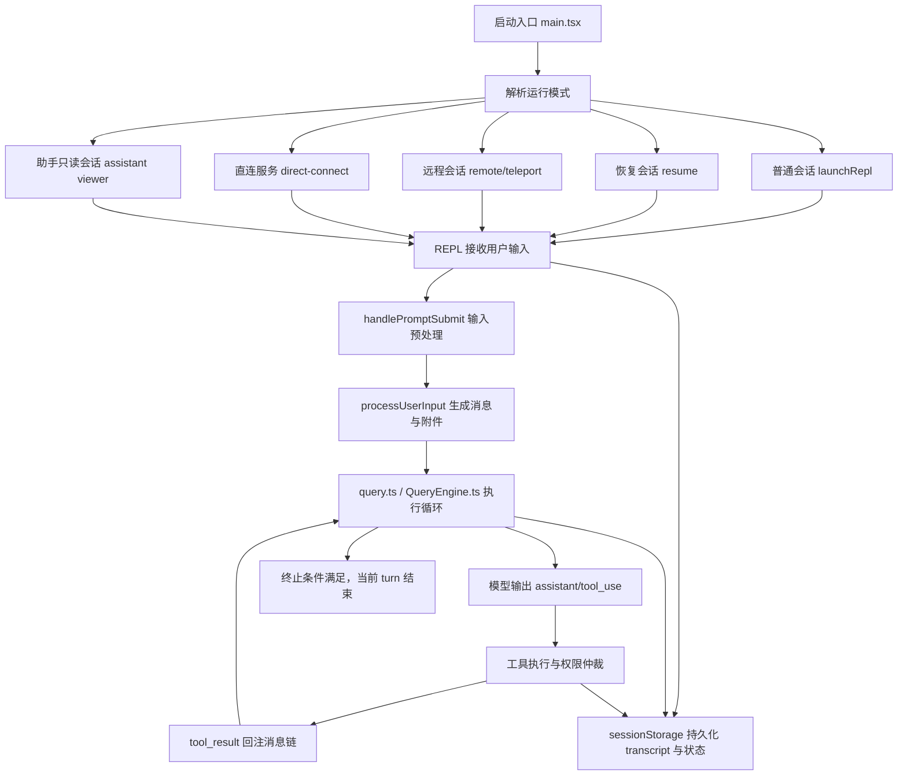
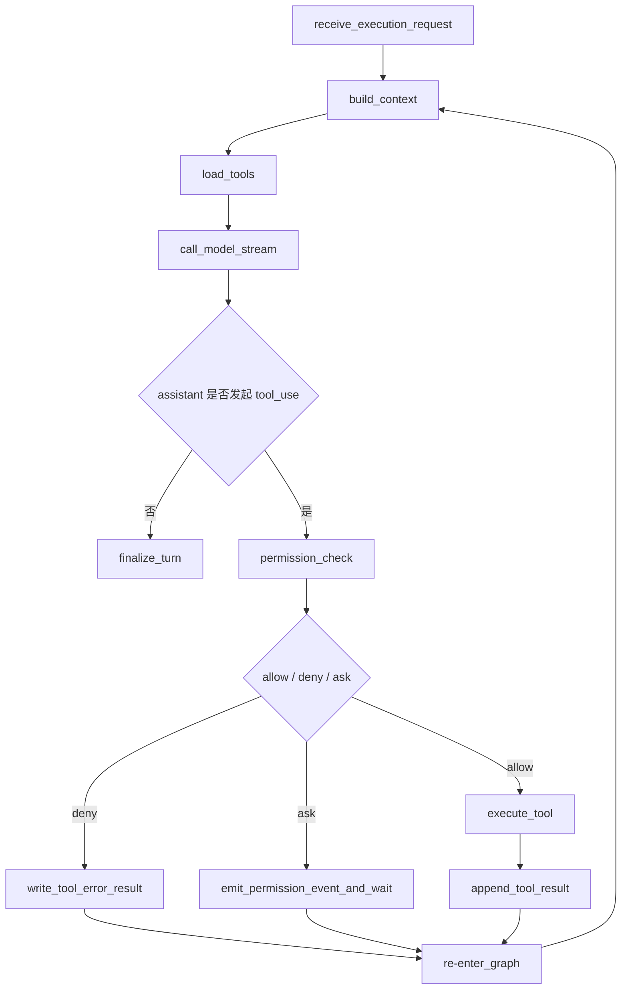

# Claude Code UI Agent 全流程复刻规范

## 1. 文档目的

本文基于对 `Ai_Test_Agent/claude_code_ui_Agent/restored-src/src` 的深度阅读，整理 Claude Code UI Agent 的真实执行链路、核心模块职责、状态流转方式，以及在我们当前项目中如何用 `FastAPI + LangGraph + Vue` 进行可扩展复刻。

这份文档不是简单的“源码笔记”，而是后续开发 `Enterprise_AI_QA_Agent` 时的架构实施规范。目标是：

1. 复刻 Claude Code 的完整运行骨架，而不是只复刻聊天页面。
2. 先把“执行框架”搭起来，后续只需要接入不同 agent 模块。
3. 让前端、后端、会话、工具、权限、任务编排、远程执行都能按统一协议扩展。
4. 把项目开发方式收敛到“可观察、可恢复、可扩展、可自动化测试”的工程化路径上。

## 2. 本次重点阅读范围

本次重点梳理了以下关键文件：

- `main.tsx`
- `replLauncher.tsx`
- `screens/REPL.tsx`
- `query.ts`
- `QueryEngine.ts`
- `tools.ts`
- `Tool.ts`
- `hooks/useCanUseTool.tsx`
- `utils/handlePromptSubmit.ts`
- `utils/processUserInput/processUserInput.ts`
- `utils/sessionStorage.ts`
- `server/createDirectConnectSession.ts`
- `remote/RemoteSessionManager.ts`
- `bridge/createSession.ts`
- `coordinator/coordinatorMode.ts`

这些文件共同揭示了 Claude Code 的一个核心事实：

> Claude Code 不是“输入一句话 -> 调一次模型 -> 输出答案”的聊天工具，而是一个带有多模式入口、可恢复会话、工具权限仲裁、递归执行引擎、远程会话桥接、协调者模式与子代理体系的完整 agent 操作系统。

## 3. Claude Code 的真实架构分层

从执行职责看，Claude Code 可以拆成 8 层：

1. 启动与模式选择层
2. 会话恢复与会话路由层
3. 交互 REPL 层
4. 用户输入预处理层
5. Agent 查询递归执行层
6. 工具权限仲裁层
7. 状态持久化与回放层
8. 远程会话 / 协调者 / 子代理扩展层

对应理解如下：

| 层级 | Claude Code 角色 | 关键文件 | 我们项目要复刻什么 |
|------|------------------|----------|--------------------|
| 启动层 | CLI 参数解析、功能开关、运行模式分流 | `main.tsx` | FastAPI 启动后端服务，前端负责模式入口，后端保留统一 session bootstrap |
| 会话路由层 | normal / resume / remote / assistant / direct-connect / ssh | `main.tsx` | 统一 `session_mode` 与 `runtime_mode` |
| REPL 层 | UI、输入、消息、滚动、提示、提交、打断、恢复 | `screens/REPL.tsx` | Vue Shell + Store + 事件驱动消息流 |
| 输入预处理层 | slash command、粘贴附件、hook、meta prompt、命令队列 | `handlePromptSubmit.ts` `processUserInput.ts` | 前后端共同实现输入规范化与命令调度 |
| 执行层 | 模型流式响应、工具调用、工具结果回注、递归下一轮 | `query.ts` `QueryEngine.ts` | LangGraph 执行图 + 可恢复状态机 |
| 权限层 | allow / deny / ask / 自动判断 / 协调者权限 | `useCanUseTool.tsx` | 工具调用审批中心 |
| 持久化层 | transcript、message chain、resume、rewind、file history | `sessionStorage.ts` | 会话日志、状态快照、事件存储 |
| 扩展层 | remote session、bridge、subagent、coordinator | `RemoteSessionManager.ts` `coordinatorMode.ts` | 多 agent 编排、远程运行、后续 agent 插拔 |

## 4. Claude Code 的顶层执行观

Claude Code 真正复刻时，不能只看前端界面，要复刻的是下面这条链：



这个流程意味着：Claude Code 的核心不是“页面”，而是“状态驱动的多轮执行循环”。

## 5. 顶层入口 main.tsx 的职责

`main.tsx` 的职责不是简单挂载 UI，而是整个应用的总调度器。它至少完成以下事情：

1. 初始化全局配置、状态、功能开关、模型配置、工具注册、MCP、插件、统计等基础设施。
2. 解析当前运行模式。
3. 在不同模式之间做分发。
4. 生成初始 `AppState`、初始 `messages`、初始 `tools`。
5. 根据模式把会话交给 `launchRepl(...)` 或其它执行入口。

从源码看，Claude Code 在入口阶段就把下面这些能力当成一等公民：

- resume 会话
- direct connect 连接远端 Agent Server
- ssh remote 远程执行
- assistant viewer 只读远程助手会话
- teleport / remote 控制远程执行
- coordinator mode 协调者模式

这点对我们很关键：

> 我们的 `Enterprise_AI_QA_Agent` 后端不能只设计成单一聊天接口，而要从一开始就把“运行模式”设计进 session 模型。

建议我们后端统一抽象：

```text
SessionMode:
- normal
- resumed
- direct_connect
- remote
- assistant_viewer
- coordinator
- background_task
```

## 6. launchRepl 的真实含义

`replLauncher.tsx` 非常薄，只做一件事：

- 延迟加载 `App` 和 `REPL`
- 通过 `renderAndRun(root, <App><REPL /></App>)` 把整个运行环境启动起来

也就是说：

- `main.tsx` 决定“进入哪种会话”
- `REPL.tsx` 决定“会话内部如何运行”

在我们项目里对应关系应该是：

- 后端决定：创建什么 session、session 带什么运行能力
- 前端决定：以什么壳层展示 session，如何消费事件流

## 7. REPL.tsx 才是交互执行主控台

`screens/REPL.tsx` 是 Claude Code 最重要的交互层文件之一。它不是单纯消息列表，而是一个“会话控制器”，负责：

1. 接收用户输入
2. 构造 `handlePromptSubmit(...)` 的入参
3. 管理 `messagesRef`、滚动、输入框、工具进度、通知、stash、恢复等 UI 状态
4. 维护 `onSubmit`
5. 维护 `onQuery`
6. 处理远程消息转发
7. 处理中断
8. 处理 rewind / restore / resume
9. 处理 pending hooks / pending command queue / background tasks
10. 把执行结果变成用户可见消息流

这意味着前端不能只是一个“调用 `/chat` 接口”的页面，而需要是一个真正的会话壳层，至少要有：

- 会话消息区
- 输入区
- 工具执行状态区
- 权限审批弹窗
- 当前运行模式标记
- 当前任务 / 当前回合状态
- 远程/本地连接状态
- 恢复与重放能力

## 8. 用户输入不是直接发给模型，而是先经过 handlePromptSubmit

`handlePromptSubmit.ts` 体现了 Claude Code 的一个关键设计：

> 用户输入先走“输入调度层”，而不是直接进入模型。

它大致做了这些事：

1. 判断是不是队列中的命令。
2. 判断输入是否为空。
3. 处理退出命令。
4. 解析粘贴引用与附件占位符。
5. 处理本地即时 slash command。
6. 如果当前回合正在执行，则根据模式决定排队还是中断。
7. 构造 `ProcessUserInputContext`。
8. 调用 `processUserInput(...)`。
9. 再决定是否真正进入 query 循环。

这层在我们项目里必须单独存在，不能和 `agent 执行图` 混在一起。建议命名为：

- `PromptSubmissionService`
- `InputOrchestrator`

推荐职责：

- 文本输入规范化
- slash command / 系统命令识别
- 文件、图片、结构化附件归一化
- prompt hooks
- 回合抢占 / 队列排队
- 组装执行上下文
- 决定是否进入 LangGraph

## 9. processUserInput 的核心职责

`processUserInput.ts` 负责把“原始输入”变成“模型上下文中的合法消息”。

它做的事情包括：

1. 提前把用户输入显示到界面上。
2. 调用 `processUserInputBase(...)` 解析输入类型。
3. 区分 prompt / bash / slash command / bridge 输入 / meta 输入。
4. 处理图片内容、附件内容、IDE 选择上下文。
5. 调用 prompt submit hooks。
6. 根据 hook 结果决定：
   - 阻断
   - 附加上下文
   - 继续执行
7. 返回 `messages + shouldQuery + allowedTools + model + effort + nextInput` 等信息。

这个设计说明 Claude Code 并不是“消息数组 append 一条 user message”这么简单，而是把每次输入都当成一次受控事件。

在我们项目中建议抽象为：

```text
UserInputEvent
-> normalize
-> enrich
-> attach context
-> run hooks
-> produce ExecutionRequest
```

## 10. Claude Code 有两个执行引擎

这是本次阅读里最重要的发现之一。

Claude Code 实际上有两套执行入口：

1. `REPL.tsx + query.ts`
2. `QueryEngine.ts`

它们并不是重复代码，而是分别服务于两种场景。

### 10.1 交互式执行引擎

`REPL.tsx + query.ts` 负责 TUI/交互式会话：

- 面向前端 UI
- 处理流式消息
- 处理工具执行进度
- 处理实时权限审批
- 处理 UI 中断、通知、回滚
- 处理远程桥接消息

### 10.2 Headless / SDK 执行引擎

`QueryEngine.ts` 负责无 UI 的执行场景：

- SDK 调用
- 服务端任务
- headless agent
- 可嵌入外部系统的执行器

它内部仍然维护完整的消息状态、工具权限逻辑、系统提示词组装和查询链路，只是没有 REPL 那层 UI 控制。

### 10.3 对我们项目的直接启示

我们也必须从一开始就拆成两层：

1. `Interactive Session Runtime`
2. `Headless Agent Runtime`

推荐映射：

| Claude Code | 我们项目 |
|-------------|----------|
| `REPL.tsx + query.ts` | `Vue Session Shell + FastAPI SSE/WebSocket + LangGraph Runtime` |
| `QueryEngine.ts` | `FastAPI AgentService + LangGraph Headless Executor` |

这样后续才能同时支持：

- 网页聊天
- 定时任务
- 测试执行 agent
- 后台运行 agent
- 多 agent 协作

## 11. query.ts 才是 Claude Code 的 agent 递归心脏

`query.ts` 是 Claude Code 真正的执行循环核心。它不是“一次 API 调用”，而是一个递归状态机。

核心思路是：

1. 取当前消息链。
2. 组装 system prompt / user context / system context / tools。
3. 发起一次模型请求。
4. 接收流式输出。
5. 如果输出中包含 tool_use，则执行工具。
6. 把 tool_result 重新插入消息链。
7. 刷新工具集、附件、记忆、技能上下文。
8. 再递归进入下一轮 query。
9. 直到满足终止条件才结束。

这意味着 Claude Code 的一次用户请求，本质上是：

> 一个多轮、可插工具、可变上下文、可中断、可压缩上下文、可恢复的 agent turn。

### 11.1 query.ts 每轮大致会处理的内容

- stream request start
- query tracking / chain tracking
- 消息链裁剪与 compact
- memory / skill prefetch
- system prompt 拼装
- token budget / output budget
- 模型流式输出
- stop hooks / post hooks
- tool orchestration
- queued commands 消费
- attachment 注入
- refresh tools
- 继续下一轮或结束

### 11.2 我们项目必须复刻的不是代码形态，而是这个状态机

在 `LangGraph` 中应该映射为一个显式图：



注意：

- LangGraph 节点不是“页面逻辑节点”，而是“运行时状态转移节点”。
- 每个节点都要可追踪、可持久化、可恢复。

## 12. Tool.ts 与 tools.ts：工具系统是中心化注册的

Claude Code 工具体系有两个重要特征：

1. 工具有统一协议。
2. 工具在中心注册，再按运行模式过滤。

从 `Tool.ts` 可以看到 `ToolUseContext` 非常大，说明工具不是被动函数，而是运行时上下文中的一级参与者。它可以访问：

- 当前会话消息
- AppState
- setAppState
- 通知
- 文件状态缓存
- 工具 JSX
- 中断控制器
- 权限上下文
- 记忆加载状态
- 文件历史
- attribution 状态
- 当前 agentId / agentType
- 运行模型 / querySource / tools 刷新器

从 `tools.ts` 可以看到：

- 所有基础工具集中注册
- REPL/simple/coordinator/权限模式下会动态过滤
- MCP tools 会被动态合并
- 某些模式会禁用某些工具

这对我们项目的约束非常明确：

> 后续 agent 模块不能直接写死在 LangGraph 节点里，必须全部挂到统一 Tool Registry。

建议我们后端定义：

```text
ToolRegistry
ToolDefinition
ToolExecutionContext
ToolPermissionPolicy
ToolResultEnvelope
```

每个 agent 模块以后只需注册：

- 工具名
- 输入 schema
- 执行函数
- 权限等级
- 前端展示类型
- 是否支持流式进度
- 是否允许后台执行

## 13. useCanUseTool：权限系统是一级架构，不是补丁功能

Claude Code 对工具权限的处理非常成熟。`useCanUseTool.tsx` 表现出以下决策层级：

1. 配置规则直接允许
2. 配置规则直接拒绝
3. 配置规则要求询问
4. 协调者模式特殊处理
5. swarm/worker 特殊处理
6. speculative bash classifier 自动判断
7. 若仍无法决策，则弹交互式审批

也就是说，Claude Code 的权限不是“执行前弹个确认框”，而是完整的策略仲裁系统。

我们项目必须明确设计：

```text
PermissionCenter
|- static policy
|- runtime policy
|- auto classifier
|- human approval
|- audit log
```

推荐权限结果统一为：

```json
{
  "behavior": "allow | deny | ask",
  "reason": "string",
  "updated_input": {},
  "source": "policy | classifier | human | coordinator"
}
```

前端需要准备：

- 工具审批弹窗
- 批量放行
- 会话级允许规则
- 工具调用审计记录

## 14. sessionStorage：Claude Code 的恢复能力来自事件持久化

`sessionStorage.ts` 说明 Claude Code 不是只维护内存消息，而是维护：

- transcript JSONL
- 会话 ID
- message chain
- subagent transcript
- agent metadata
- 远程 agent metadata
- file history snapshot
- content replacement record
- rewind / restore 所需元数据

这层很关键，因为它决定了 Claude Code 支持：

- resume
- fork session
- transcript replay
- 子 agent 恢复
- 工作区状态关联

对我们项目来说，最低可行版本也不能只有数据库一张 `chat_message` 表。建议从一开始设计三类存储：

1. `session`
2. `session_event`
3. `session_snapshot`

推荐语义如下：

| 类型 | 用途 |
|------|------|
| session | 会话元数据、模式、状态、当前执行位置 |
| session_event | 用户输入、assistant 输出、tool_use、tool_result、approval、interrupt、resume 等事件流 |
| session_snapshot | LangGraph checkpoint、当前上下文摘要、工具状态、文件状态摘要 |

如果后续要做 Harness engineering，这层尤其重要，因为测试 Harness 要能：

- 回放一段完整事件流
- 校验某一步 tool_use 是否出现
- 校验中断/恢复是否正确
- 比较两次运行输出差异

## 15. 远程与直连模式不是附加功能，而是内建模式

Claude Code 在 `main.tsx` 中对以下模式都做了一级支持：

- direct connect
- ssh remote
- remote / teleport
- assistant viewer

### 15.1 direct connect

`createDirectConnectSession.ts` 会通过 `POST /sessions` 到远端服务创建会话，再把：

- `sessionId`
- `wsUrl`
- `authToken`

封装成 `DirectConnectConfig` 回给 REPL。

这对我们当前项目非常有参考价值，因为我们本身就在做前后端分离的 agent 系统。建议我们第一阶段就按这个思路设计：

- 前端不直接“调模型”
- 前端先向 FastAPI 创建 session
- 再通过 WebSocket/SSE 消费该 session 的执行事件

### 15.2 remote session

`RemoteSessionManager.ts` 说明远程会话至少要支持：

- WebSocket 订阅消息
- HTTP 发送用户消息
- 远程权限请求
- 远程中断
- 断线重连
- viewer only 模式

这说明我们后续不应该把“本地执行”和“远程执行”写成两套完全不同的系统，而应该统一成：

```text
Session Runtime
|- local runtime
|- remote runtime adapter
```

### 15.3 bridge session

`bridge/createSession.ts` 体现的是另一种能力：

- 把当前环境、仓库来源、分支、历史事件组装成远端可恢复 session

对我们项目的启示是：

- 后续要支持“把当前任务切到别的执行器上”
- 需要明确 session context 协议，而不是只传一段 prompt

## 16. coordinatorMode：Claude Code 内建多代理协同思维

`coordinator/coordinatorMode.ts` 非常值得借鉴。

它不是简单添加一个“多 agent 模式”，而是把协调者模式定义成：

- 独立运行模式
- 独立 system prompt
- 独立工具可见性
- 独立 worker 能力边界
- 独立结果接收协议

它明确区分：

- coordinator 负责理解用户目标、拆解任务、派工、汇总
- worker 负责执行具体研究、实现、验证

这正是我们后续接入各种 agent 模块时最应该借鉴的结构。

对我们项目建议统一定义：

```text
AgentRole
|- coordinator
|- worker
|- verifier
|- planner
|- observer
```

后续每个 agent 模块都只是某种 role 的实现，不要把 agent 当成一个不可分类的黑盒。

## 17. Claude Code 真正的“全流程执行”拆解

下面是适合我们复刻的标准流程。

### 阶段 1：会话建立

1. 前端打开页面。
2. 前端请求后端创建 session。
3. 后端返回：
   - session_id
   - session_mode
   - runtime_mode
   - 可用工具列表
   - 可用 agent 列表
4. 前端建立 SSE 或 WebSocket 连接。
5. 前端加载历史 transcript。

### 阶段 2：用户提交输入

1. 用户输入文本、命令、附件。
2. 前端把输入封装成 `submit_request`。
3. 后端进入 `Input Orchestrator`。
4. 后端完成：
   - normalize
   - parse attachments
   - run hooks
   - generate execution request
5. 如果是本地命令或系统命令，直接执行并返回事件。
6. 如果需要进入 agent 执行，则启动 LangGraph。

### 阶段 3：执行图运行

1. 生成当前轮上下文。
2. 载入工具列表。
3. 载入 memory / session summary / selected files / harness context。
4. 调用模型，流式输出事件。
5. 如果模型只输出文本，则结束当前轮。
6. 如果模型产生 tool_use，则进入工具权限节点。

### 阶段 4：工具执行

1. 权限中心决策 allow / deny / ask。
2. 如果 ask，则推送前端审批事件并暂停图执行。
3. 如果 allow，则执行工具。
4. 工具执行中持续推送 progress 事件。
5. 工具结束后写入 tool_result 事件。
6. 把 tool_result 重新注入消息链。
7. 返回 LangGraph 继续下一轮。

### 阶段 5：回合结束

1. 当没有新的 tool_use，或者达到终止条件时结束。
2. 写入 turn summary。
3. 刷新 session snapshot。
4. 前端更新消息、状态和可恢复点。

### 阶段 6：恢复 / 回放 / 续跑

1. 用户重新进入页面。
2. 前端根据 session_id 拉取 transcript 与 snapshot。
3. 后端恢复执行上下文。
4. 如果任务未完成，可继续执行。
5. 如果只是查看，则进入 viewer 模式。

## 18. 我们项目的推荐目标架构

结合 Claude Code 与我们现有技术栈，建议采用以下映射架构。

### 18.1 后端分层

```text
FastAPI
|- API Layer
|  |- session routes
|  |- message routes
|  |- tool approval routes
|  |- runtime routes
|
|- Application Layer
|  |- SessionService
|  |- PromptSubmissionService
|  |- RuntimeService
|  |- ToolRegistryService
|  |- PermissionService
|  |- TranscriptService
|
|- Agent Runtime Layer
|  |- LangGraph Orchestrator
|  |- Node: build_context
|  |- Node: call_model
|  |- Node: permission_gate
|  |- Node: execute_tool
|  |- Node: append_result
|  |- Node: finalize_turn
|
|- Infrastructure Layer
|  |- LLM adapter
|  |- Event store
|  |- Snapshot store
|  |- WebSocket/SSE gateway
|  |- File store
```

### 18.2 前端分层

```text
Vue
|- App Shell
|- Session Workspace
|  |- Header / runtime status
|  |- Sidebar / sessions / agents
|  |- Message Timeline
|  |- Tool Activity Panel
|  |- Permission Modal
|  |- Input Composer
|
|- Store
|  |- session store
|  |- message store
|  |- runtime store
|  |- approval store
|
|- Transport
|  |- session api
|  |- event stream client
|  |- approval api
```

## 19. 第一阶段必须先做的“框架骨架”

当前阶段不要急着接复杂 agent，先把 Claude Code 的骨架打通。建议优先顺序如下。

### P0：统一 Session Runtime

必须先完成：

- session 创建接口
- session 恢复接口
- transcript 查询接口
- SSE/WebSocket 事件通道
- session 状态机

### P1：Prompt Submission Layer

必须先完成：

- 用户输入标准协议
- slash command 基础协议
- 附件消息协议
- hook 扩展点
- execution request 生成器

### P2：LangGraph 主执行图

必须先完成：

- build_context
- call_model
- detect_tool_calls
- permission_gate
- execute_tool
- append_tool_result
- finalize_turn

### P3：Tool Registry

必须先完成：

- 工具注册机制
- 工具 schema
- 工具执行上下文
- 工具事件协议
- 工具结果回注机制

### P4：Permission Center

必须先完成：

- allow / deny / ask
- 前端审批事件
- 审批结果回传
- 审计日志

### P5：Snapshot / Resume

必须先完成：

- event store
- graph checkpoint
- resume session
- replay transcript

## 20. 第二阶段再接入 agent 模块

当上面的框架骨架稳定后，再把 agent 作为插件接入。推荐方式不是“每个 agent 一套接口”，而是：

```text
AgentModule
|- metadata
|- role
|- tools
|- prompt templates
|- graph extension nodes
|- verification hooks
```

可优先接入的 agent 类型：

1. Planner Agent
2. QA/Test Agent
3. Web Automation Agent
4. Code Review Agent
5. Report Agent

## 21. 与 Harness Engineering 的结合方式

既然我们后续项目开发要结合 Harness engineering，那么 Claude Code 的复刻不能停留在“能跑”，还要满足“可验证”。

建议从一开始把下面这些 Harness 点埋进去：

### 21.1 事件可回放

每次执行必须记录：

- 输入事件
- 模型输出事件
- tool_use 事件
- permission 事件
- tool_result 事件
- interrupt / resume 事件

### 21.2 执行可断言

Harness 至少能断言：

- 某次输入是否触发了指定工具
- 工具调用顺序是否正确
- 审批流程是否生效
- 被拒绝后是否正确降级
- resume 后状态是否一致

### 21.3 输出可比对

Harness 需要支持：

- transcript diff
- event sequence diff
- final answer diff
- tool result diff

### 21.4 失败可定位

每个 LangGraph 节点、每次工具调用、每次审批等待都必须带：

- session_id
- turn_id
- step_id
- tool_call_id
- correlation_id

这样后续自动化测试和线上故障才能追踪。

## 22. 复刻 Claude Code 时最容易走偏的地方

以下是必须避免的错误方向。

### 错误 1：只复刻聊天框和消息列表

这样只能得到一个普通聊天页面，得不到 agent runtime。

### 错误 2：把工具执行硬编码在模型调用后

正确做法是中心化 Tool Registry + Permission Center。

### 错误 3：没有事件存储，只存最终消息

这样无法恢复、无法回放、无法做 Harness。

### 错误 4：把前端做成纯展示层

前端需要承担 session shell、审批交互、流式事件消费、状态重建。

### 错误 5：LangGraph 只做一次线性流转

Claude Code 的本质是递归多轮 agent turn，而不是单轮链式调用。

### 错误 6：后续接 agent 时再考虑 role 和 runtime mode

这些必须在第一阶段框架里就设计好。

## 23. 我们项目的建议目录落地方式

建议 `Enterprise_AI_QA_Agent` 逐步收敛成如下结构：

```text
Enterprise_AI_QA_Agent
|- Agent_Server
|  |- src
|  |  |- api
|  |  |- application
|  |  |- runtime
|  |  |- graph
|  |  |- tools
|  |  |- permissions
|  |  |- sessions
|  |  |- storage
|  |  |- schemas
|  |  |- adapters
|  |  |- main.py
|
|- agent_web
|  |- src
|  |  |- views
|  |  |- components
|  |  |- stores
|  |  |- services
|  |  |- composables
|  |  |- types
|
|- docs
|  |- Claude_Code_UI_Agent_全流程复刻规范.md
```

## 24. 第一阶段开发验收标准

当以下标准满足时，才算“Claude Code 骨架复刻成功”：

1. 能创建 session，并返回统一 session metadata。
2. 前端能通过 SSE/WebSocket 看到流式执行事件。
3. 用户输入不会直接进模型，而是先走输入调度层。
4. LangGraph 能完成至少一轮“模型 -> 工具 -> 再入图 -> 输出”的闭环。
5. 工具调用有权限中心拦截。
6. transcript 与 snapshot 可持久化。
7. 页面刷新后能恢复当前 session 历史。
8. 至少支持一种 agent role 和一种 tool registry 扩展方式。
9. Harness 能回放一条完整执行链并做断言。

## 25. 最终结论

Claude Code 借鉴价值最大的，不是某个界面，也不是某个 prompt，而是这 6 个架构原则：

1. 运行模式是一等公民。
2. REPL/UI 只是 session runtime 的外壳，不是核心执行器。
3. 用户输入必须先进入输入调度层。
4. Agent 执行本质是一个递归、多轮、可恢复的状态机。
5. 工具系统和权限系统必须中心化。
6. 事件存储、快照恢复、Harness 验证必须从第一阶段就纳入设计。

对于 `Enterprise_AI_QA_Agent`，正确的开发路线应该是：

> 先复刻 Claude Code 的“执行骨架”，再往骨架上挂各种 agent 模块，而不是先做很多 agent，再反过来补运行时框架。

---

## 附：给当前项目的直接实施建议

如果以最小可落地方案推进，建议下一步马上进入以下任务：

1. 在 `Agent_Server` 中建立统一 `session + event + snapshot` 数据模型。
2. 在后端建立 `PromptSubmissionService + LangGraph Runtime + ToolRegistry + PermissionService` 四个基础服务。
3. 在前端建立 `Session Shell + Message Timeline + Tool Activity + Permission Modal + Event Stream Client` 五个基础模块。
4. 用一个最小 agent 流程跑通：
   - 用户输入
   - 模型回复
   - 触发一个工具
   - 请求审批
   - 工具执行
   - 回注结果
   - 最终结束
5. 同步补一套 Harness 用例，验证整条执行链。

这条路线才是对 Claude Code “全流程执行”的正确复刻路径。
