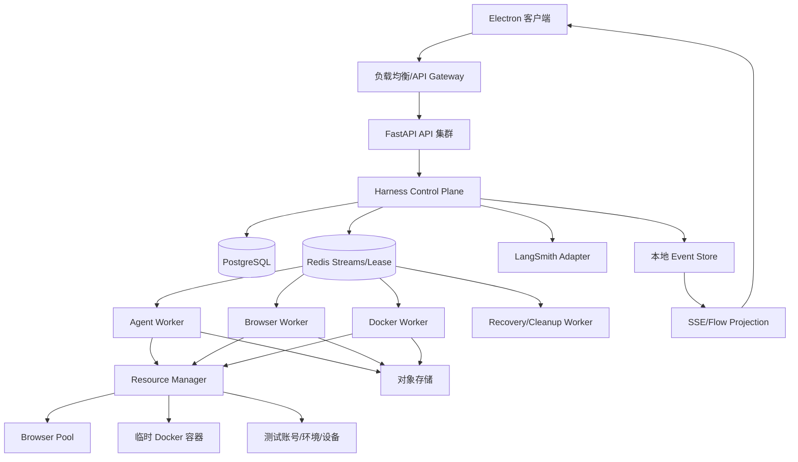

# AI 测试系统 Harness Engineering 架构升级方案

版本：v1.1
适用范围：`Enterprise_AI_QA_Agent`  
依据：当前后端 Session/Turn/Flow、TestRun/RunItem/Attempt、Worker、资源执行机制，以及项目已有《Harness Engineering 开发规范》和《LangChain 生态深度升级工程方案》。

## 1. 结论

本项目应采用“业务执行主链 + Harness 控制层 + LangSmith 观测旁路”的架构。

核心分工如下：

```text
Agent              决定下一步做什么
Harness            决定能不能做、怎么做、在哪里做、如何恢复
Redis              调度任务、维护租约、广播实时事件
PostgreSQL         保存最终业务事实和测试结果
LangSmith          记录 LangChain/LangGraph/模型/工具调用 Trace，并支持评测
对象存储           保存截图、视频、日志和测试报告
```

LangSmith 不替代本地的“编排轨迹”、测试状态和资源调度。它是 Agent 观测与评测旁路；本地数据库和事件流仍是产品运行主链。

## 2. 当前项目基础与主要差距

当前项目已经具备以下基础：

- 前端 Flow 页面按 `session_id` 查询 Flow、历史事件和 SSE；
- 后端已有 Session、Turn、Approval、FlowProjectionService；
- 测试执行已有 `TestRun -> RunItem -> Attempt` 层级；
- PostgreSQL 已具备任务领取、租约、心跳和恢复相关能力；
- 已有 Coordinator/Worker 执行模型；
- 项目已有 LangSmith Adapter、脱敏、旁路失败降级和 Trace 对账设计；
- 当前已明确采用 LangSmith 观察 LangChain 生态调用链，而不是替换本地 Flow。

需要升级的主要问题：

1. API 进程不应直接承载长时间 Agent 执行；
2. 进程内 `asyncio.Queue` 不适合多 API 实例和多服务器 SSE 广播；
3. 浏览器、Docker、测试账号和环境需要统一资源租约；
4. AI 对话中的测试执行必须正式落到 TestRun/RunItem/Attempt；
5. Agent 工具调用需要统一入口、Schema、权限、超时、重试和审计；
6. Agent 自述“完成”不能直接等同于测试通过；
7. LangSmith Trace 必须与本地业务 ID 对账，但不能成为主链依赖；
8. 长任务需要 checkpoint、恢复和旧 Worker fencing；
9. 全局、项目、运行、资源四级并发配额需要统一治理。

## 3. 目标架构



### 3.1 控制面与执行面

控制面负责：

- 创建 Session、Turn、TestRun、RunItem、Attempt；
- 任务入队和取消；
- 资源申请和配额判断；
- 状态机迁移；
- Policy、Approval、Checkpoint、Recovery；
- 本地事件写入和 LangSmith Trace 关联。

执行面负责：

- Agent 推理；
- 工具调用；
- 浏览器操作；
- Docker 测试；
- 日志、截图、视频和报告采集。

执行面发生故障时，控制面必须能够发现、回收、恢复或标记人工处理。

## 4. Harness 八层设计

项目已有 Harness 规范定义了八层能力。本次架构升级按以下方式落地。

### 4.1 Context Harness

为 Agent 提供分层、版本化、可追溯上下文：

- 用户任务描述；
- 项目、套件和用例版本；
- 页面知识、DOM 快照和接口契约；
- 历史缺陷和执行结果；
- 当前环境和资源信息；
- 当前 Session/Turn/RunItem 状态。

上下文引用应写入 `context_refs`，不要把全部知识直接拼进 Prompt。过期页面知识必须标记 `stale`。

### 4.2 Task Harness

所有 AI 行为必须映射到标准阶段：

```text
目标理解 → 测试计划 → 探索/生成 → 执行 → 验证 → 评估 → 报告 → 知识回写
```

每个阶段必须有结构化状态、输入输出、错误和完成条件。

### 4.3 Tool Harness

所有工具经过统一 Tool Gateway：

```text
Agent 请求
→ Schema 校验
→ Policy 检查
→ 资源检查
→ 配额检查
→ 执行工具
→ 结果校验
→ 写入事件和 Trace
```

工具协议至少包含：

```text
tool_id
input_schema
output_schema
timeout
retry_policy
permission_level
error_codes
audit_fields
```

### 4.4 Execution Harness

LangGraph/Agent 节点必须具备：

- 明确输入输出；
- 节点级事件；
- 超时和异常处理；
- checkpoint；
- 可取消；
- 可恢复；
- 可关联 LangSmith 子 Run。

### 4.5 Verification Harness

验证层判断“操作是否真的完成”：

- UI 断言；
- DOM 或页面状态；
- API 响应；
- 截图；
- 控制台/网络日志；
- Docker 退出码；
- 业务规则。

### 4.6 Evaluation Harness

执行 Agent 不得单独决定最终质量。建议分为：

```text
Executor Agent → Verifier → Evaluator → Human Approval（必要时）
```

测试结果至少区分：

```text
AgentStatus
ExecutionStatus
TestStatus
EvidenceStatus
EvaluationStatus
```

### 4.7 Observability Harness

本地 Flow 和 LangSmith 各自承担不同职责：

| 能力 | 本地 Flow | LangSmith |
|---|---|---|
| 面向用户的实时轨迹 | 负责 | 不负责 |
| session/run_item 状态 | 负责 | Metadata 关联 |
| 浏览器、Docker 资源状态 | 负责 | 仅记录摘要 |
| LangChain/LangGraph 调用树 | 摘要 | 负责 |
| Token、模型耗时、模型输入输出 | 摘要/脱敏 | 负责 |
| 测试最终结果 | 负责 | 评测引用 |
| 断线重连和历史回补 | 负责 | 不负责 |

### 4.8 Cleanup/Entropy Harness

负责清理：

- 过期 Redis Stream；
- 僵尸浏览器；
- 孤儿 Docker 容器；
- 过期资源租约；
- 失效页面知识；
- 重复测试用例；
- 长期失败任务和历史报告。

## 5. 任务与状态模型

### 5.1 业务层级

```text
Project
  └── SuiteVersion
        └── TestRun
              └── RunItem
                    └── Attempt
                          ├── Session
                          ├── Turn
                          ├── ToolJob
                          ├── FlowEvent
                          └── Artifact
```

一个 Session 可以发起多个 Run；一个 Run 可以包含多个 RunItem；每次重试必须创建新的 Attempt，不能重置并复用已完成的 RunItem。

### 5.2 RunItem 状态

```text
queued
waiting_resource
claimed
running
waiting_approval
passed
failed
error
timeout
cancelled
recovery_required
```

状态迁移只能由后端状态机完成。每次迁移写入 PostgreSQL 和本地事件流。

## 6. Redis 任务与事件设计

当前并发不大，不必先引入 Kafka 或 RabbitMQ。Redis 使用方式如下：

```text
Redis Streams  任务队列和实时事件
Redis Hash     任务、Worker、资源状态
Redis Set      资源集合和项目任务集合
Redis ZSet     超时、延迟和优先级任务
Lua/事务       原子领取、续租和释放
```

建议 Stream：

```text
stream:agent_tasks
stream:test_run_tasks
stream:browser_tasks
stream:docker_tasks
stream:tool_jobs
stream:recovery_tasks
stream:cleanup_tasks
stream:dead_letters
```

每条任务包含 `task_id/session_id/project_id/run_id/run_item_id/attempt_id/trace_id`。

任务使用 Consumer Group。Worker 领取后进入 Pending，执行期间 heartbeat，完成后 ACK；超时任务由 Recovery Worker 重新认领。

不能用 Pub/Sub 作为唯一轨迹来源，因为断线会丢事件。SSE 应从 Redis Stream 读取，并通过 PostgreSQL 回补历史。

## 7. 资源隔离与并发

### 7.1 资源租约

资源统一抽象为 `ResourcePool` 和 `ResourceLease`。租约包含：

```text
resource_id
resource_type
session_id
project_id
run_id
run_item_id
attempt_id
lease_token
lease_expire_at
last_heartbeat_at
```

领取必须是原子操作，旧 Worker 使用 fencing token 后不得覆盖新 Attempt 的状态。

### 7.2 资源类型

```text
browser
docker_container
test_account
test_environment
device
port
filesystem_workspace
```

### 7.3 并发规则

```text
同一测试账号：默认只能执行一个任务
同一 BrowserContext：只能属于一个 Attempt
同一 Docker 容器：只能属于一个 Attempt
同一环境：按照环境容量限制
同一项目：使用项目并发配额
不同 Session：可以并行，但资源必须重新租约
```

### 7.4 浏览器

服务端主方案建议使用 Playwright Browser Pool：

- 普通任务使用独立 BrowserContext；
- 高隔离任务使用独立浏览器进程；
- 强隔离任务使用 Docker + 独立浏览器；
- 每个任务隔离 Cookie、Storage、下载目录、临时目录和证据目录。

ego-lite 不应作为当前服务端通用浏览器池的默认实现；如果后续接入，应通过专用 Browser Worker/CDP 适配器接入 Resource Manager。

### 7.5 Docker

容器必须标记：

```text
session_id/project_id/run_id/run_item_id/attempt_id/worker_id
```

必须限制 CPU、内存、磁盘、网络、日志大小和执行时间，并由 Cleanup Worker 回收异常容器。

## 8. LangSmith 集成边界

### 8.1 定位

LangSmith 负责：

- LangChain/LangGraph 调用树；
- 模型、Prompt、工具和子图 Trace；
- Token、耗时、错误和输入输出摘要；
- Dataset/Experiment 评测；
- Agent 轨迹质量分析。

本地系统负责：

- Session、Turn、Run、RunItem、Attempt；
- 资源租约和并发调度；
- 浏览器/Docker 状态；
- 测试断言和证据；
- SSE、Flow 和断线恢复。

### 8.2 ID 对账

业务 ID 不直接替代 LangSmith 外部 Run ID。建议在本地保存：

```json
{
  "trace_id": "trace_local_001",
  "external_trace_id": "trace_langsmith_001",
  "session_id": "session_001",
  "run_id": "run_001",
  "run_item_id": "item_001",
  "attempt_id": "attempt_001"
}
```

LangSmith `project_name` 按环境区分，例如 `enterprise-ai-qa-agent-dev/staging/prod`；业务 `project_id` 放入 metadata，不把二者混为同一个主键。

### 8.3 Metadata 和 Tags

建议写入：

```text
session_id
turn_id
project_id
run_id
run_item_id
attempt_id
trace_id
agent_name
tool_name
environment
```

敏感数据必须先做字段白名单、脱敏和截断。LangSmith 上报失败不得阻塞：

```text
本地 Event → 本地 Flow/SSE → LangSmith 异步旁路上报
```

## 9. 编排轨迹设计

编排轨迹是面向产品用户的本地事件投影，不是 LangSmith UI 的替代品。

统一事件格式：

```json
{
  "event_id": "evt_001",
  "event_type": "tool_completed",
  "session_id": "session_001",
  "turn_id": "turn_001",
  "run_id": "run_001",
  "run_item_id": "item_001",
  "attempt_id": "attempt_001",
  "trace_id": "trace_001",
  "worker_id": "worker_001",
  "timestamp": "2026-09-15T10:00:00Z",
  "status": "success",
  "payload": {}
}
```

前端按 `session_id` 查看会话轨迹，同时支持按 `run_id/run_item_id/attempt_id` 过滤测试执行轨迹。错误必须形成结构化终态事件，例如 `tool.failed`、`browser.failed`、`test_item.failed`、`worker.lost` 和 `resource.acquire_failed`。

## 10. API 与前端工作台

API 服务建议保持以下边界：

```text
POST /sessions                         创建会话
POST /sessions/{id}/messages            创建 Turn/提交任务
POST /test-runs                         创建 TestRun
GET  /test-runs/{id}                    查询运行状态
GET  /test-runs/{id}/items              查询用例状态
GET  /sessions/{id}/flow                查询本地 Flow
GET  /sessions/{id}/events              SSE 实时事件
POST /runs/{id}/cancel                  取消运行
POST /attempts/{id}/retry               创建新的 Attempt
```

前端工作台应至少提供：

- 会话与编排轨迹；
- 测试运行列表；
- RunItem 状态和等待资源原因；
- 浏览器/Docker/账号资源占用；
- 错误与恢复状态；
- LangSmith Trace 深链接；
- 截图、视频、日志和报告证据。

## 11. 高可用与故障恢复

### Worker 崩溃

heartbeat 超时后：

```text
Attempt → recovery_required
资源租约 → 释放或回收
旧 Worker → fencing
Recovery Worker → 创建新 Attempt 或人工处理
```

### API 重启

任务已写入 PostgreSQL 和 Redis Stream 时，API 重启不影响 Worker 执行。

### SSE 断线

客户端携带 `last_event_id` 重连，先读 Redis Stream，必要时从 PostgreSQL 回补，然后继续订阅。

### LangSmith 不可用

本地 Session、Flow、SSE、测试执行、结果入库和恢复必须继续工作；LangSmith 只记录告警和待补偿状态。

## 12. 贯穿式标识、日志和监控

每个请求、任务、执行尝试和资源操作都必须贯穿以下标识：

```text
request_id
trace_id
session_id
turn_id
run_id
run_item_id
attempt_id
worker_id
resource_id
```

推荐关系：

```text
request_id → trace_id → session_id/turn_id
                         → run_id/run_item_id/attempt_id
                           → worker_id/resource_id
```

结构化日志必须能够回答：谁创建了任务、任务进入哪个队列、哪个 Worker 领取、领取了哪些资源、何时开始执行、调用了哪些工具、哪一步失败、是否重试、是否释放资源、最终结果是什么。

关键日志至少包含 `timestamp`、`event_type`、上述关联 ID、`status`、`error_code`（如适用）和 `duration_ms`（如适用）。监控指标必须支持按 `project_id`、`run_id`、`worker_id` 和资源类型聚合。

建议监控指标：

```text
API QPS
API 错误率
任务提交量
任务积压量
任务等待时间
任务执行时间
RunItem P50/P95/P99
Worker 利用率
浏览器占用率
Docker 占用率
资源租约超时数
任务重试数
死信任务数
SSE 连接数
Redis Stream Pending 数
PostgreSQL 连接使用率
```

## 13. 并发控制和配额

建议设置四级配额：

```text
全局配额
  └── 项目配额
        └── TestRun 配额
              └── 资源类型配额
```

示例：

```text
全局 Agent 任务：20
项目 A：5
项目 B：8
单次 TestRun：4
浏览器：10
Docker：10
测试账号：每个账号 1
```

配额判断顺序为“全局 → 项目 → TestRun → 资源类型 → 指定资源租约”。资源不足时任务状态必须为：

```text
waiting_resource
```

并记录具体原因：

```text
等待浏览器资源
等待测试账号
等待 Docker 容量
等待环境并发槽位
等待项目配额
```

项目管理页面应显示：

```text
运行中：8
排队中：12
等待浏览器：3
等待 Docker：2
执行失败：1
已完成：20
```

同时可下钻到 `run_id`、`run_item_id`、`attempt_id`、Worker、资源和等待原因。

## 14. 监控与验收指标

必须监控：

```text
API QPS 和错误率
任务积压和 Pending 数
任务等待时间
RunItem P50/P95/P99
Worker 利用率
浏览器/Docker 利用率
租约超时和孤儿资源数
重试和死信数量
SSE 连接数和事件延迟
PostgreSQL 连接池使用率
LangSmith 上报失败数和对账成功率
```

验收必须覆盖：

1. 多客户端同时创建不同 Session；
2. 多 Session 同时执行不同测试用例；
3. 同一账号和同一环境的资源竞争；
4. 同一 Session 多个 RunItem 并行；
5. Worker 强杀后的恢复；
6. API 重启后的任务连续性；
7. Redis 短暂不可用；
8. SSE 断线重连和历史回补；
9. LangSmith 关闭、开启和故障三种模式；
10. 重复提交、取消、超时和重试；
11. 测试结果、证据、Flow 和 LangSmith Trace 对账。

## 15. 实施顺序

### P0：统一契约和主链

- 统一 AgentTaskState、ToolResult、FlowEvent；
- 所有测试执行落到 TestRun/RunItem/Attempt；
- 完善错误终态和状态机；
- 建立本地 `trace_id` 与 LangSmith `external_trace_id` 对账。

### P1：Redis 调度与资源租约

- Redis Streams Consumer Group；
- Worker heartbeat、ACK、Pending 恢复；
- Browser/Docker/账号/环境 Resource Manager；
- 项目和资源并发配额；
- SSE 从进程内队列迁移到 Redis Streams。

### P2：完整 Harness

- Tool Gateway；
- Policy Engine；
- Checkpoint/Recovery；
- Verification/Evaluation；
- 前端资源和证据工作台。

### P3：性能与高可用

- API/Worker 独立扩容；
- Redis Sentinel/Cluster；
- PostgreSQL 连接和查询优化；
- 分阶段并发压测；
- LangSmith Trace 采样、对账和成本控制。

## 16. 最终架构判断

本方案贴合项目当前实际，也符合 Harness Engineering 的核心要求：

```text
Session     隔离对话上下文
TestRun     隔离一次测试运行
RunItem     隔离测试用例
Attempt     隔离一次执行尝试
Harness     控制 Agent 能力和生命周期
Policy      约束工具和高风险操作
Lease       隔离浏览器、Docker、账号和环境
Redis       调度任务、维护租约、广播事件
PostgreSQL  保存最终事实和测试结果
LangSmith   观测 LangChain 生态调用链和评测
Worker      执行实际 Agent/工具/测试
Artifact    保存可审计证据
Recovery    处理超时、崩溃和断点恢复
```

在当前中等并发目标下，Redis 足以承担调度和事件职责；系统能否扛住，关键不在于是否引入更重的消息中间件，而在于是否完成任务化执行、资源租约、状态机、恢复机制、证据验证和 LangSmith 非阻塞观测这几个架构闭环。

## 17. 工程实施基线

本章将前面的目标架构转换为工程团队可执行的实施基线。实施时不得跳过契约、状态、恢复和验收中的任一项；如果某项暂未实现，必须明确标记为 `planned`，不能在产品页面显示为已完成。

### 17.1 模块实施矩阵

| 子系统 | 当前项目承载位置 | 目标职责 | 首批交付物 |
|---|---|---|---|
| Session/Turn | `src/application`、`src/api/routes/sessions.py` | 会话和轮次生命周期、取消、审批、租约 | Turn 状态机、ID 传播、错误终态 |
| Flow | `src/application/flow/projection_service.py`、前端 Flow | 本地产品轨迹投影和回放 | 稳定 Event ID、Redis Stream 回补、多客户端订阅 |
| TestRun | `src/application`、TestRun/RunItem/Attempt 服务 | 测试运行和用例状态事实 | RunItem 原子领取、Attempt 重试、项目状态汇总 |
| Runtime/Worker | `src/runtime`、Coordinator | 长任务执行和 Worker 接管 | Redis Consumer、heartbeat、ACK、recovery |
| Tool Runtime | 工具运行时和 ToolJob | 工具 Schema、超时、重试、审计 | Tool Gateway、统一 ToolResult、错误码 |
| Resource | 新增 Resource Manager 边界 | 浏览器、Docker、账号、环境租约 | 原子 claim、续租、fencing、cleanup |
| Observability | `src/application/observability`、LangSmith Adapter | 本地事件、指标、LangSmith Trace | Trace 对账、脱敏、旁路失败降级 |
| Frontend Workbench | `agent_web/src/features/flow` 及项目管理页面 | 展示任务、资源、证据和 Trace | Run Dashboard、Resource Dashboard、Trace Link |

### 17.2 实施约束

- 不在领域模型或 API DTO 中直接暴露 LangSmith SDK 类型；
- 不新建与 `TestRun/RunItem/Attempt` 重复的任务事实表；
- Redis 任务消息丢失或重复时，必须以 PostgreSQL 状态和幂等键为准；
- 所有状态写入必须验证当前 Attempt、租约 token 和版本；
- LangSmith 上报失败只能影响观测状态，不能改变测试业务结果；
- 前端不得直接连接 Redis 或 LangSmith；
- 任何新 Agent 或 Tool 必须先接入 Harness，再进入主流程。

## 18. 契约冻结与实现顺序

### 18.1 第一批冻结的契约

先冻结以下结构，再实现 Redis Worker，避免前后端和 Worker 各自定义格式：

```text
TaskEnvelope
FlowEvent
ToolResult
ResourceLease
Checkpoint
VerificationResult
EvaluationResult
```

所有结构都必须带 `schema_version`。新增字段向后兼容；删除或改变语义必须升级版本并同步所有消费者。

### 18.2 任务提交事务

任务提交采用“业务事实先落库、消息随后入队”的模式：

```text
开启数据库事务
→ 创建/锁定 TestRun、RunItem、Attempt
→ 写入 outbox/task record
→ 提交事务
→ 发布 Redis Stream
→ 标记发布结果
```

如果 Redis 发布失败，任务不能被标记为执行中，应由 Outbox Relay 重试发布。Worker 领取前必须再次从 PostgreSQL 校验 Attempt 是否仍可执行。

### 18.3 任务完成事务

```text
Worker 执行
→ 写入 Artifact 和验证结果
→ 使用 lease/fencing token 更新 Attempt
→ 更新 RunItem/TestRun 汇总
→ 写入终态事件
→ ACK Redis 消息
```

写库失败时不得先 ACK；ACK 成功但最终结果未落库的异常由对账任务扫描并恢复。

## 19. 配置、灰度与回滚

所有新能力必须配置化，并提供关闭路径：

```text
TASK_DISPATCH_MODE=inline|redis
REDIS_STREAM_ENABLED=true|false
RESOURCE_LEASE_ENABLED=true|false
CHECKPOINT_ENABLED=true|false
LANGSMITH_ENABLED=true|false
LANGSMITH_FAILURE_MODE=best_effort
FLOW_EVENT_SOURCE=postgres|redis_stream
```

推荐灰度顺序：

1. 先保持现有执行路径，开启 ID、日志和指标；
2. 对非关键测试项目启用 Redis 任务调度；
3. 启用浏览器和 Docker 资源租约；
4. 启用 Worker 恢复和 Cleanup；
5. 扩大项目范围并逐级增加并发；
6. 最后启用 LangSmith 长任务分段 Trace 和 Dataset/Experiment 评测。

每个阶段必须保留以下回滚能力：

- 停止接收新 Redis 任务；
- 等待或恢复已领取任务；
- 将未执行任务回退为 `queued`；
- 关闭新事件消费者但保留 PostgreSQL 历史；
- 关闭 LangSmith 不影响本地 Flow 和测试执行。

## 20. 当前已验证能力与验收边界

以下能力已有项目专项文档或测试证据支撑：

- Session/Flow/Event/Snapshot 的本地链路；
- PostgreSQL RunItem/Attempt 领取和租约；
- Session/Turn/Approval 的 fencing 和跨 Worker 竞争控制；
- LangSmith Adapter、脱敏、父子 Trace 和旁路失败降级；
- 部分真实模型、ToolJob 和 LangSmith 对账链路；
- 短时并发阶梯和部分 PostgreSQL 容量验证。

以下内容不能仅凭现有短时测试宣称完成，必须单独验收：

- Redis 多实例任务调度的生产稳定性；
- API 多进程下 SSE 的完整断线回补；
- 浏览器池和 Docker 池的真实容量上限；
- Worker 强杀后的完整资源回收和新 Attempt 接管；
- 4 小时、24 小时长任务稳定性；
- LangSmith 限流、断网、进程退出时的 Trace flush；
- 项目配额、资源等待和前端管理页面的一致性。

## 21. 上线前检查清单

上线前必须逐项留存证据：

- [ ] 所有请求和任务均可按九类 ID 串联；
- [ ] PostgreSQL、Redis、Worker、SSE 和 LangSmith 能通过 `trace_id` 对账；
- [ ] 同一个 RunItem 不会被两个有效 Attempt 同时执行；
- [ ] 同一个账号、浏览器 Context、Docker 容器不会被两个租约同时持有；
- [ ] Worker 崩溃后任务和资源都能进入恢复或清理流程；
- [ ] Redis Pending、死信、租约超时和孤儿资源均有监控；
- [ ] Flow 页面能显示成功、失败、取消、超时和恢复状态；
- [ ] 项目管理页面能显示运行中、排队中、等待资源、失败和完成汇总；
- [ ] LangSmith 不可用时，本地执行链仍通过；
- [ ] 并发压测已记录 QPS、错误率、P50/P95/P99、连接数和资源利用率；
- [ ] 所有失败样本均保留日志、事件、Artifact 和恢复结果。
